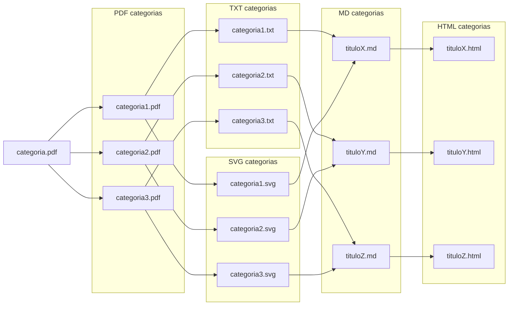
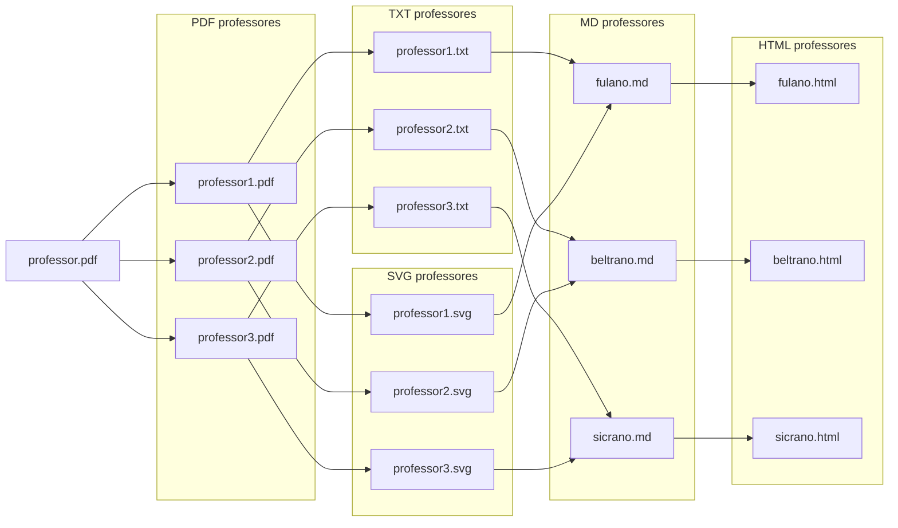

# Colario

Horário colaborativo.

## Fluxo de processamento do PDF para HTML

```mermaid
graph LR

    cat_pdf["categoria.pdf"]

    subgraph "PDF categorias"
        cat1_pdf["categoria1.pdf"]
        cat2_pdf["categoria2.pdf"]
        cat3_pdf["categoria3.pdf"]
    end

    cat_pdf --> cat1_pdf & cat2_pdf & cat3_pdf

    subgraph "TXT categorias"
        cat1_txt["categoria1.txt"]
        cat2_txt["categoria2.txt"]
        cat3_txt["categoria3.txt"]
    end

    cat1_pdf -->  cat1_txt
    cat2_pdf -->  cat2_txt
    cat3_pdf -->  cat3_txt

    subgraph "SVG categorias"
        cat1_svg["categoria1.svg"]
        cat2_svg["categoria2.svg"]
        cat3_svg["categoria3.svg"]
    end

    cat1_pdf -->  cat1_svg
    cat2_pdf -->  cat2_svg
    cat3_pdf -->  cat3_svg

    subgraph "MD categorias"
        titX_md["tituloX.md"]
        titY_md["tituloY.md"]
        titZ_md["tituloZ.md"]
    end

    cat1_txt & cat1_svg --> titX_md
    cat2_txt & cat2_svg --> titY_md
    cat3_txt & cat3_svg --> titZ_md

    subgraph "HTML categorias"
        titX_html["tituloX.html"]
        titY_html["tituloY.html"]
        titZ_html["tituloZ.html"]
    end

    titX_md --> titX_html
    titY_md --> titY_html
    titZ_md --> titZ_html
```

Ilustração do processamento para o arquivo PDF dos professores:

```mermaid
graph LR

    prof_pdf["professor.pdf"]

    subgraph "PDF professores"
        prof1_pdf["professor1.pdf"]
        prof2_pdf["professor2.pdf"]
        prof3_pdf["professor3.pdf"]
    end

    prof_pdf --> prof1_pdf & prof2_pdf & prof3_pdf

    subgraph "TXT professores"
        prof1_txt["professor1.txt"]
        prof2_txt["professor2.txt"]
        prof3_txt["professor3.txt"]
    end

    prof1_pdf -->  prof1_txt
    prof2_pdf -->  prof2_txt
    prof3_pdf -->  prof3_txt

    subgraph "SVG professores"
        prof1_svg["professor1.svg"]
        prof2_svg["professor2.svg"]
        prof3_svg["professor3.svg"]
    end

    prof1_pdf -->  prof1_svg
    prof2_pdf -->  prof2_svg
    prof3_pdf -->  prof3_svg

    subgraph "MD professores"
        fulano_md["fulano.md"]
        beltrano_md["beltrano.md"]
        sicrano_md["sicrano.md"]
    end

    prof1_txt & prof1_svg --> fulano_md
    prof2_txt & prof2_svg --> beltrano_md
    prof3_txt & prof3_svg --> sicrano_md

    subgraph "HTML professores"
        fulano_html["fulano.html"]
        beltrano_html["beltrano.html"]
        sicrano_html["sicrano.html"]
    end

    fulano_md --> fulano_html
    beltrano_md --> beltrano_html
    sicrano_md --> sicrano_html
```